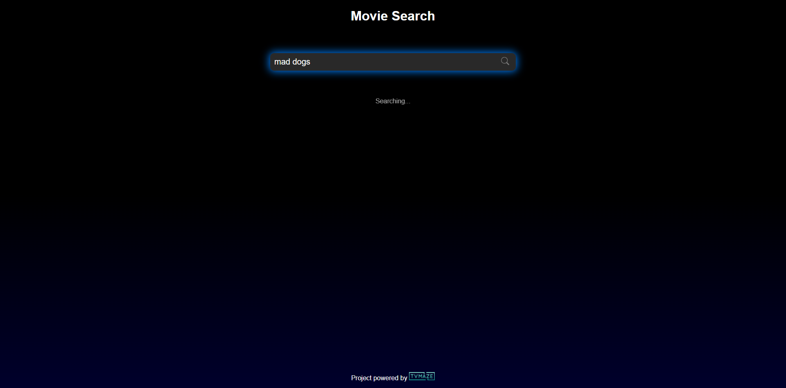

# MovieSearch 🎬

A simple and responsive movie & TV show search website built with **HTML, CSS, and vanilla JavaScript**.

MovieSearch uses the **TVmaze API** to search for shows and display their posters, titles, and links to more information.

## ✨ Features

* 🔎 Search for movies and TV shows
* 🎞️ Display matching results with posters
* 🔗 Open a show's official page
* ⚡ Fast API-based search
* 📱 Responsive design
* 🌙 Clean dark-themed interface

## 🛠️ Built With

* **HTML5**
* **CSS3**
* **JavaScript**
* **Axios**
* **TVmaze API**

## 🚀 Getting Started

Clone the repository:

```bash
git clone https://github.com/amantes30/MovieSearch.git
cd MovieSearch
```

Since this is a static website, no installation or build process is required.

Simply open `index.html` in your browser, or run it using a local development server.

## 📂 Project Structure

```text
MovieSearch/
├── index.html      # Main page
├── style.css       # Styling and layout
├── app.js          # Search and API logic
├── screenshot.png  # Project preview
└── README.md
```

## 🔗 Live Demo

**[Open MovieSearch](https://amantes30.github.io/MovieSearch/)**

## 📸 Preview



## 📡 API

MovieSearch is powered by the [TVmaze API](https://www.tvmaze.com/api), which provides the show search data and images used by the application.

## 👤 Author

**amantes30**

[GitHub](https://github.com/amantes30)
